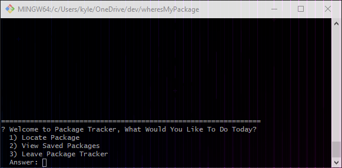
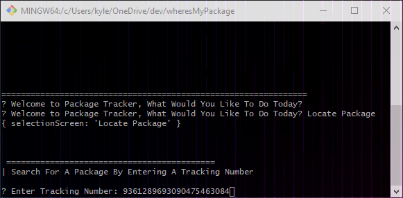
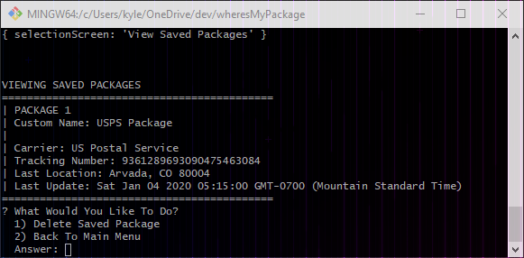

## Description:

Package Tracker is a Node.js application that interfaces with several tracking API's (such as USPS, UPS, FedEx and DHL) as well as a SQL database. 

## Purpose:

Over the holiday season, my wife and I ordered a lot of packages from different online vendors. I found myself constantly searching around for tracking numbers in my email to check the delivery status of the packages. I started to leave browsers open with the inputted tracking numbers for quick reference, but then forgot which tracking number belonged to each item. This is when I came up with the idea to make a lightweight package tracking application. I didn't need a robust front end UI and decided to use Node.js with [inquirer](https://www.npmjs.com/package/inquirer#examples) (for basic command-line navigation). 

## Challenges:

This project was pretty straight forward and there wasn't many challenges over all. The main hurdle was interfacing with the different shipping carrier's APIs since documentation left a lot to be desired. After starting to build out the requests for FedEx, I decided to opt into using another package, [shipIt](https://www.npmjs.com/package/shipit), to reduce the amount of setup involved to communicate with the shipping carrier API's. 

## Setup:

There is a little setup involved with this application since I didn't want to expose my API keys. To do this, I created a apikeys.sql file that is listed in the gitignore file. To recreate this file, I have included the schema below:

    DROP DATABASE IF EXISTS packagetrackerapikeys;
    CREATE DATABASE packagetrackerapikeys;
    
    USE packagetrackerapikeys;
    
    CREATE TABLE carrierapikeys (
        id INT AUTO_INCREMENT PRIMARY KEY,
        carrier VARCHAR(255) NOT NULL,
        friendly_name VARCHAR(255) NOT NULL,
        current_api_status INT,
        api_key VARCHAR(255) NOT NULL,
        username VARCHAR(255),
        password VARCHAR(255),
        account_number VARCHAR(255),
        meter_number VARCHAR(255)
    );
    
    INSERT INTO carrierapikeys (carrier, friendly_name, current_api_status, api_key, username, password, account_number, meter_number)
        VALUES 
        ('ups','UPS',0,'*********','*********','*********','',''),
        ('fedex','FedEx',0,'*********','','*********','*********','*********'),
        ('dhl','DHL',0,'','*********','*********','',''),
        ('usps','US Postal Service',0,'*********','*********','*********','','')
    ;
    
    SELECT * FROM carrierapikeys

## Future Plans:

Even though Package Tracker was able to solve my basic needs for tracking packages and adding custom tags, there are a few things that I plan to add. Some of these ideas are:

- Add additional mail carriers such as [Amazon.com](http://amazon.com).
- Create an in-depth tracking option to show every update for given packages.
- Allow for multiple users and separate databases for saved packages.
- Add option for Recent search history.
- Move saved package databases to a hosted server.

## Sample Images:

- Main menu

    

- Search functionality

    
    

- Saved Packages

    
